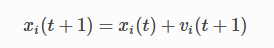
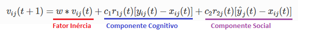

# Desenvolvimento de algoritmos de otimização por enxame de partículas (PSO) para ajuste fino de modelos SVM
Essa é uma implementação cujo o objetivo é trazer o PSO para o contexto do aprendizado de máquina, propondo seu uso como uma abordagem alternativa para o tunning de hiperparâmetros. Foi realizado 80 simulações de movimentação de 15 partículas os resultados estão descritos abaixo.

# Definições

## Modelo Escolhido
- O modelo escolhido foi o SVM, por conter dois principais hiperparâmetros (C e Gamma) contínuos (e não discretos) o que aumenta a performane do PSO para cumprir a tarefa de otimização.

## Espaço explorado
- Escolhemos dois hiperparâmetros para tunning do algorítmo sendo C e gamma. Portanto, o espaço explorado será o espaço R2 definido pelos limites:
- C pertence ao intervalo [0.01, 100]
- Gamma pertence ao intervalo [0.01, 100]

## Bibliotecas
- Utilizamos a biblioteca de enxame PYSWARM, a biblioteca de machine learning do SKLEARN e também biblioteca de animação da MATPLOTLIB para simular o movimento do enxame.
  
## Função fitness (objetivo)
- A função fitness ou função objetivo do nosso enxame é encontrar a posição onde ocorre a melhor acurácia média calculada sobre 5 folds em dados de treino de um modelo de SVM.
  
## Função de posição de particulas
A cada iteração do enxame as particulas têm suas posições atualizadas de acordo com a seguinte função retirada da documentação do PYSWARM

 

## Função de velocidade de partículas
A cada iteração do enxame as particulas têm suas velocidades recalculadas de acordo com a seguinte função retirada da documentação do PYSWARM

 

A velocidade possui 3 componentes principais, sendo elas:
- Componente de inércia que é o quanto a velocidade da particula na iteração tende a manter-se igual á iteração anterior. 
- Componente cognitivo que mensura o quanto a particula tende a movimentar-se em direção a melhor posição que ela já passou nas iterações anteriores
- Componente social que mensura o quanto a particula tende a movimentar-se em direção á melhor conformação do enxame como um todo

Temos que definir os seguintes parâmetros relacionados á essas velocidades para iniciar o algorítmo:
w:  parâmetro que pondera o componente de inércia
c1: parâmetro que pondera o componente cognitivo
c2: parâmetro que pondera o componente social

r1 e r2: geradas aleatoriamente a cada iteração para permitir que o enxame explore mais o espaço e evitar que fique estacionado em algum mínimo local.

## Função Fitness (Objetivo)
- Acurácia média de 5 folds no treinamento de um modelo de SVM

# Metodologia
- Foi elegido um dataset público para demonstração do PSO para tunning dos hiperparâmetros C e Gamma do modelo de SVM.
- Realizou-se 80 iterações (ou simulações) de 15 partículas do enxame e computou-se suas posições em R2 (C, gamma) assim como a acurácia do modelo de SVM treinado 
- Percorremos um grid de 10.000 datapoints no espaço R2 (C, gamma) para mapear o comportamento da acurácia em função desses dois hiperparâmetros
- Realizou-se uma suavização para os pontos não lidos dos hiperparâmetros para estimar a acurácia esperada.
- Realizou-se uma simulação da posição inicial do enxame posicionadas aleatoriamente inicialmente até a posição onde 1 das partículas do enxame atingiu o máximo da acurácia.

# Resultados

- Como pode ser observada pela simulação, a particula 11 encontrou os melhores conjuntos de hiperparâmetros 

# Resultados e Conclusões

## Conclusões Gerais
- A exploração do enxame foi capaz de encontrar os melhores hiperparâmetros para um modelo de SVM
- Obtivemos 94% de acurácia em dados de treino e 97.5% em dados de teste. Sem overfit!
- Ja na 9ª iteração o PSO foi capaz de encontrar hiperparametros com 91.6% de acurácia!
- PSO convergiu para melhor solução na sua 46ª iteração com 94% de acurácia.
- Foram realizadas 80 iterações, após as 46ª iteração o enxame continuou explorando o espaço de hiperparâmetros limitando-se pelo espaço definido R2 e pelos fatores de velocidade definidos.

## Simulação enxame

- Por conta de uma limitação da biblioteca plotamos apenas duas iterações a posição inicial do enxame e a posição na iteração 46ª onde a particula 11 encontrou o melhor conjunto de hiperparâmetro.

- Os parâmetros de velocidade foram escolhidos para que o enxame pudesse explorar o máximo o espaço disponível.
- Por isso, nem todas as particulas finalizaram as iterações na região do ótimo global destacado em amarelo. 
- Com N_iteracoes tendendo ao infinito ou suavizando os fatores de velocidade teriamos todas as partículas do enxame convergindo quase totalmente para área de melhor acurácia.

# Bibliografia
https://pyswarms.readthedocs.io/en/latest/
